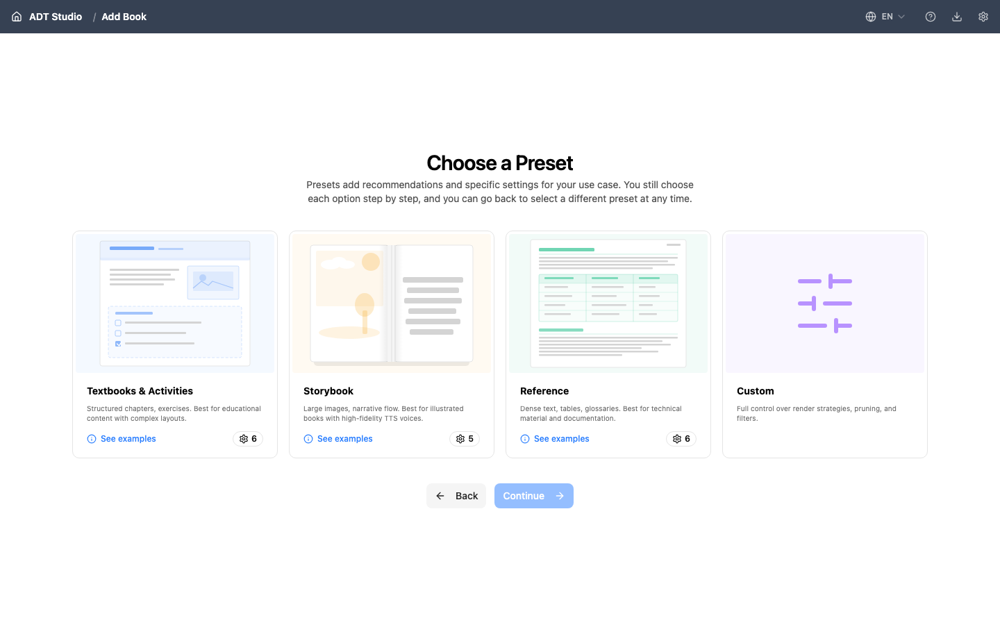

Extraction is the step where ADT Studio reads your PDF and converts it into structured content — text, figures, and layout — that all later steps build on. This is where the AI does its first and most important pass over your book.

Before extraction runs, you configure how it should treat your document. This configuration happens in a few sub-steps, right after you upload your PDF.

<Steps>

<Step>
### Choose a Preset

A preset is a starting configuration that matches the kind of document you are converting. It pre-selects sensible settings so you don't have to configure everything manually.

- **Textbooks & Activities** — structured chapters and exercises. Best for educational content with complex layouts.
- **Storybook** — large images and narrative flow. Best for illustrated books, paired with high-fidelity narration.
- **Reference** — dense text, tables, and glossaries. Best for technical material and documentation.
- **Custom** — full control over render strategies, pruning, and filters, with nothing pre-selected for you.

Presets are a starting point, not a commitment. After choosing one, you can still adjust any individual setting in the steps below. Switching presets later resets the configuration you've already changed, so pick the closest match first.

Each clip below runs a real printed page through the full pipeline for its matching preset — extraction, layout, and the accessibility features that come with it.

**Textbooks & Activities** — a printed science chapter and a workbook activity page, both rebuilt into structured, accessible content.

<video controls playsInline aria-label="A printed science textbook chapter on biomes is converted into an accessible e-learning page with easy-read mode, a glossary, and sign language." className="w-full rounded-lg border border-[color:var(--color-border)]">
  <source src="/videos/los-biomas.mp4" type="video/mp4" />
</video>

<video controls playsInline aria-label="A printed workbook activity page is converted into an AI-generated, interactive accessible activity." className="w-full rounded-lg border border-[color:var(--color-border)]">
  <source src="/videos/cuaderno5.mp4" type="video/mp4" />
</video>

**Reference** — a dense, multi-column textbook page rebuilt as a responsive, semantic web layout.

<video controls playsInline aria-label="A complex, multi-column printed textbook page is converted into a responsive web layout." className="w-full rounded-lg border border-[color:var(--color-border)]">
  <source src="/videos/brazil.mp4" type="video/mp4" />
</video>

**Storybook** — an illustrated story page gains text-to-speech narration, image descriptions, translations, and a quiz.

<video controls playsInline aria-label="An illustrated storybook page gains text-to-speech narration, image descriptions, translations, and an interactive quiz." className="w-full rounded-lg border border-[color:var(--color-border)]">
  <source src="/videos/momo.mp4" type="video/mp4" />
</video>
</Step>

<Step>
### Basic Information

Here you confirm the essentials:

- **PDF File** — the file you just uploaded.
- **Project Name** — the unique identifier ADT Studio uses as your book's folder name. It's suggested from your file name, but you can change it.
- **How much of this book do you want to process?** — **Whole book** to convert everything, **Page range** to pick a subset (handy for testing on one chapter of a long PDF before committing to the whole thing), or **Split into parts** to hand out page-range parts to different people and merge their finished work back into one book later (see [Splitting a book into parts](#splitting-a-book-into-parts) below).

There's no separate "book title" or "source language" field here — the project name doubles as the identifier, and language is set later in the Languages step.
</Step>

<Step>
### Visual Layout

This step tells ADT Studio how your document is visually organised, so extraction can interpret the pages correctly:

- **Render Strategy** — how pages get rebuilt (template-based, which is fast and free, or AI-powered, which adapts per page at the cost of extra processing).
- **Page Grouping Mode** — **Spread** or **Single**, whether facing pages are treated as one visual unit or independently.
- **Section Mode** — **Page Mode** or **Dynamic Mode**, how content is chunked into sections.

ADT Studio marks the option it recommends for your chosen preset — in most cases you can accept the suggestion.
</Step>

<Step>
### Content Processing

Here you choose which AI-powered processing runs on your content during extraction:

- **Activity Converter** — detect and structure exercises and activities.
- **Figure Extraction** — pull out images and diagrams as separate figures.
- **Smart Cropping** — automatically crop extracted images to their meaningful content.
- **Image Segmentation** — split composite images into their individual parts, with a **Minimum image dimension** setting for how small a segment can be.
- **Image Filter Size** — a **Min Size** and **Max Size** (in pixels) that filter out images too small or too large to be meaningful (e.g. decorative dividers or full-page backgrounds).

You do not need to enable everything now. Features you skip here can generally be run later — see [Enhance your ADT](/docs/enhance).

</Step>

<Step>
### Languages

- **Editing Language** — the language you'll work in while reviewing and editing content. Leave it empty to use the book's own language.
- **Output Languages** — one or more languages to translate the final ADT into. Leave empty to output only in the book's language.

Adding output languages here doesn't translate anything immediately — it sets what the later [Language](/docs/localize/language) stage will translate into once you reach it. Each additional language adds processing, and therefore cost, at that later stage.
</Step>

<Step>
### Create your ADT

Once your settings are configured, select **Create ADT**. This is also the moment ADT Studio actually creates your project folder (see [Import a PDF](/docs/convert-pdf/import-pdf)).

- If you already have an API key saved, extraction starts automatically. This runs page by page and can take a few minutes depending on the length of your document; you can follow progress in the interface. Sectioning is a separate step — you run it yourself afterward, from the book's **Sectioning** stage.
- If you don't have an API key saved yet, your project is created with your settings in place, and you start extraction yourself afterward from the book's **Extract** stage (a **Run** button on that stage kicks it off).

If a page fails during extraction, ADT Studio pauses and asks you to decide: **skip this page and continue**, or **stop the step**. There's a checkbox to apply the same choice to every later failure in that run, so one bad page doesn't force you to babysit the rest.

When extraction finishes, your book exists as structured content inside ADT Studio — ready for the next step: [Sectioning](/docs/convert-pdf/sectioning).
</Step>

</Steps>

## Correcting book metadata

Once extraction has run, the book's title, authors, publisher, and language appear at the top of the Extract stage, along with the page count and an AI-written summary. Select **Edit book metadata** to correct anything the AI got wrong.

Changing the language is treated differently from the other fields: since narration, translation, captions, glossary, and quizzes are all generated per-language, ADT Studio warns you that completed downstream stages will be reset and need to run again before you confirm the change. Your page sections are kept either way.

## Splitting a book into parts

For a long book, **Split into parts** lets you hand out page ranges to different people (or process them separately yourself) and reassemble the results afterward, instead of one person running the whole book start to finish. A **Split & merge** panel on the book overview handles both directions:

- **Export a part** — pick a page range and export it as its own project `.zip`. Whoever receives it opens it in their own ADT Studio and works through extraction, sectioning, and the rest, just like a normal book.
- **Merge a completed part** — upload a finished part's exported `.zip` back into the source book. ADT Studio previews what would change (pages added or replaced, any warnings) before you confirm, and flags it if the part was processed with different prompts or models than the rest of the book. Book-level stages (like the book summary) are marked stale and need a rerun once every part is merged in, since they depend on the whole book being present.

Book metadata (title, authors, publisher) travels in with whichever part contains page 1 — until that part is merged, the book stays untitled.

<Callout title="Good to know">
If you change a setting and run extraction again, ADT Studio **only redoes the work affected by your change**. Everything else is reused instantly from the saved results, at no extra cost. And nothing is lost — earlier results are kept and you can go back to them.
</Callout>
