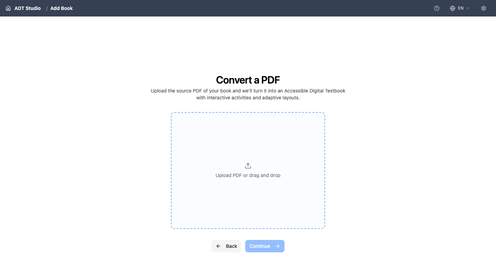

Every ADT starts as a project: one book, one folder, everything in one place. You set it up with a short wizard — starting with your PDF here, and finishing with your extraction settings on the next page.

<Callout title="Not the same as “Import a Project”">
ADT Studio also has a separate **Import a Project** option, for re-opening a project you previously exported as a `.zip`. That's different from what this page covers: bringing in a brand-new PDF. If you're starting from a PDF, look for **Convert a PDF** instead.
</Callout>

## Before you import

The quality of your ADT depends heavily on the quality of your source PDF. If you haven't yet, read [What type of content can become an ADT?](/docs/get-started/what-type-of-content) — it explains which PDFs convert well and what to check before you start.

<Callout title="First time?">
Start with a short, simple PDF (10 to 30 pages). You will see the whole process faster and learn what each step does before working with a full textbook. You don't need a short file, either — the next page lets you convert just a page range from a longer PDF.
</Callout>

## Importing

Choose **Convert a PDF**, then drop your file onto the upload screen (or use **Upload PDF** to pick it from disk) and select **Continue**. ADT Studio suggests a project name from your file name — you'll confirm or change it, along with the rest of your extraction settings, on the next page.

Nothing is written to your computer until you finish that setup and select **Create ADT**. Only then does ADT Studio create the project folder that will hold the source file, your settings, all generated content, and every version — all in one place.

You can create as many projects as you want. Each one is independent.

## What happens next

The next page, [Extract content](/docs/convert-pdf/extract), walks you through configuring — and then running — the extraction. If you already have an API key saved when you select **Create ADT**, extraction starts automatically, and you'll land on your book with that work already underway. [Sectioning](/docs/convert-pdf/sectioning) is a separate step you run afterward.
