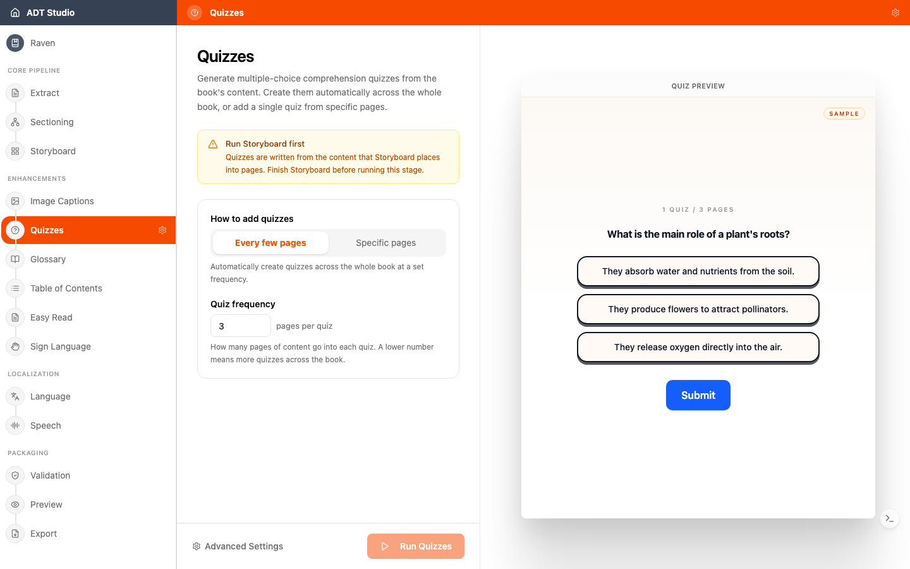

ADT Studio can generate **comprehension quizzes** from your content — accessible, interactive questions created per chapter. They give learners a way to check their own understanding as they read.

The tool also converts **activities that already exist in the book** into web-native, interactive versions during extraction — that's a separate, earlier step. Here, it's the opposite: **new questions are generated from the content itself**.

## Decisions to make

- **Where do quizzes belong?** Not every book needs them, and not every section benefits from them. Consider the audience and how the book will be used.
- **Are the questions pedagogically right?** Review the generated questions. They should test understanding of what the section actually teaches — and be answerable from the content alone.
- **Are they fair for all learners?** A question that depends on seeing an image, without an alternative way in, excludes part of your audience.

## Configure and generate

Quizzes are written from the content [Storyboard](/docs/convert-pdf/storyboard) places into pages, so that stage needs to finish first. Once it's ready, open the **Quizzes** stage and choose **how to add quizzes**:

- **Every few pages** — generate automatically across the whole book, at a **Quiz frequency** you set (how many pages of content go into each quiz — a lower number means more quizzes).
- **Specific pages** — add a single quiz tied to pages you pick yourself.

A live, interactive sample preview on the right lets you try an example question before you run anything. When you're ready, select **Run Quizzes**.

## Review and edit

Once quizzes are generated, search by question or option text, and use **Add quiz** to create one manually from specific pages at any time. Each quiz shows which pages it was generated from (or where it's shown, if you placed it manually) — select a page thumbnail to open it full-size and check the question against the source directly.

Question text and every answer option (including its explanation) are editable in place. **Delete** removes a quiz you don't want — it's recoverable from version history if you change your mind.
