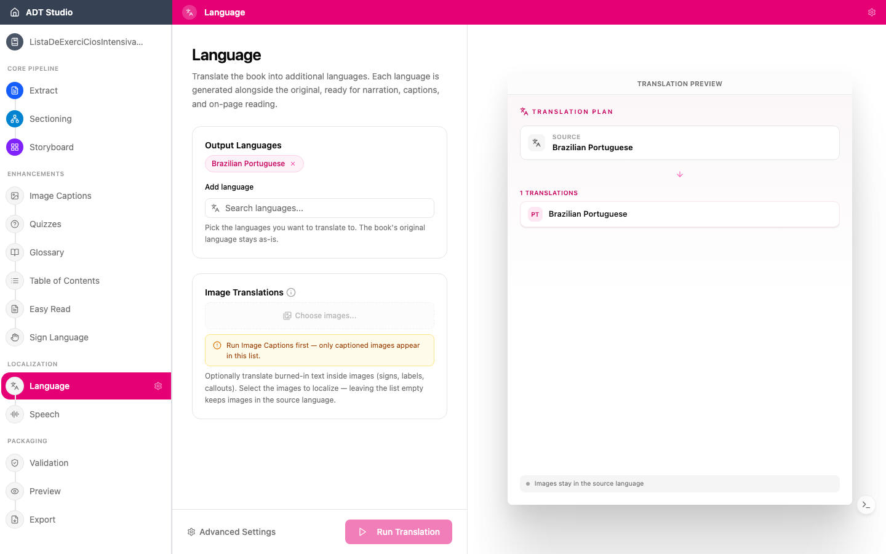

One source, many languages. ADT Studio can translate your book's content with AI support, so a single conversion effort can serve learners in several languages — including learners whose first language is not the language of instruction.

This is different from the **Languages** sub-step during [content extraction](/docs/convert-pdf/extract) — that step only selects which languages your ADT targets; this is the stage where the translations for each of those languages actually get generated.

## Decisions to make

- **Which languages does your audience actually need?** Each language adds AI processing, and therefore cost. Choose based on the classrooms the ADT will reach.
- **Who reviews the translation?** AI translation is a strong starting point, but curriculum language, local terminology, and cultural context deserve a human check — ideally by an educator who knows the audience.
- **Should images be translated too?** If a figure has burned-in text — a sign, a label, a diagram callout — decide whether it's worth regenerating that image with translated text, or leaving it in the source language.

## Configure and generate

Translation needs your book's sections typed and placed first — if [Storyboard](/docs/convert-pdf/storyboard) isn't finished, the stage tells you so instead of letting you run it. Once it's ready, open the **Language** stage and set:

- **Output Languages** — add every language you want generated alongside the original. This is independent from (and can differ from) the output languages you picked during extraction; the book's original language is never changed.
- **Image Translations** (optional) — choose specific images to regenerate with translated in-image text, using **Choose images...**. Leaving the list empty keeps every image in the source language. This option only lists images once [Image Captions](/docs/enhance/captions) has run — captioning is what identifies which images have text worth translating.

When you're ready, select **Run Translation**. Each output language is generated from the book's typed content — this isn't a review of a pre-existing translation, it's where the translation is produced.

## Review and edit

Once translation runs, every entry — page text, captions, activity answers, glossary terms, Easy Read text — becomes editable per output language. Filter by content category or by page, switch between languages with the language pills, and use the **Missing** filter to jump straight to anything that didn't get translated. Edits are saved as a new version, with the version picker to preview or roll back.

## When you're done

With translations in place, narration comes next: [Speech](/docs/localize/speech) generates voice audio in each of your ADT's languages.