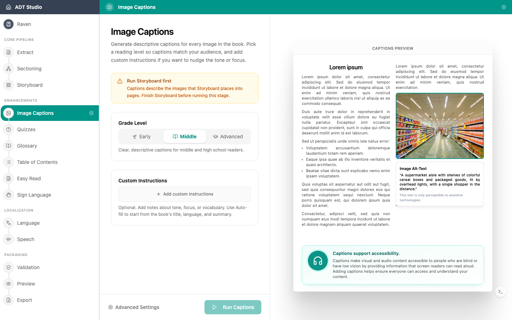

Para estudiantes ciegos o con baja visión, una imagen sin descripción es un hueco en el contenido. Este paso genera **descripciones de imágenes (texto alternativo)** para las figuras de tu libro — descripciones sensibles al contexto que realmente describen la imagen, informadas por el contenido que la rodea.

## Decisiones a tomar

- **¿Qué imágenes tienen significado?** Los diagramas, ilustraciones y gráficos necesitan descripciones. Los elementos puramente decorativos no — una descripción solo agregaría ruido para los usuarios de lectores de pantalla.
- **¿La descripción es precisa y útil?** Las descripciones generadas por IA son un buen punto de partida, pero tú conoces la intención pedagógica de cada imagen. Revísalas, especialmente donde la imagen enseña algo.

## Configurar y generar

Las descripciones necesitan que las páginas de tu libro estén diagramadas primero — si [Storyboard](/docs/convert-pdf/storyboard) todavía no ha terminado, la etapa te lo indica en lugar de dejarte ejecutarla. Cuando esté lista, abre la etapa **Descripciones de imágenes** y configura:

- **Nivel de grado** — Inicial, Medio o Avanzado — para que las descripciones coincidan con el nivel de lectura de tu audiencia.
- **Instrucciones personalizadas** (opcional) — orienta el tono, el enfoque o el vocabulario. Autocompletar redacta un punto de partida a partir del título, idioma y resumen del libro.

Una vista previa de muestra en vivo, a la derecha, muestra cómo se lee una descripción antes de que ejecutes nada. Cuando estés listo, selecciona **Ejecutar descripciones**.

## Revisar y editar

Una vez generadas las descripciones, cada imagen se convierte en una tarjeta que puedes filtrar (**Todas** / **Con descripción** / **Decorativas**, cada una con un contador), buscar por texto de la descripción o ID de imagen, y navegar entre páginas si el libro tiene varias. Selecciona una imagen para abrirla a tamaño completo; selecciona el texto de su descripción para editarlo en el lugar, con `Esc` para cancelar y `Cmd`/`Ctrl`+`Enter` para guardar.

Marcar una imagen como **Decorativa** es cómo actúas sobre la primera decisión de arriba — la excluye por completo de los lectores de pantalla y elimina la necesidad de una descripción. Un pequeño punto junto al ID de cada imagen muestra si su descripción provino de la IA o de una edición manual, y el selector de versiones te permite previsualizar y restaurar un borrador anterior.

<Callout title="Una buena descripción de imagen">
Responde a la pregunta: ¿qué se perdería un estudiante si no pudiera ver esta imagen? Ni más, ni menos.
</Callout>
