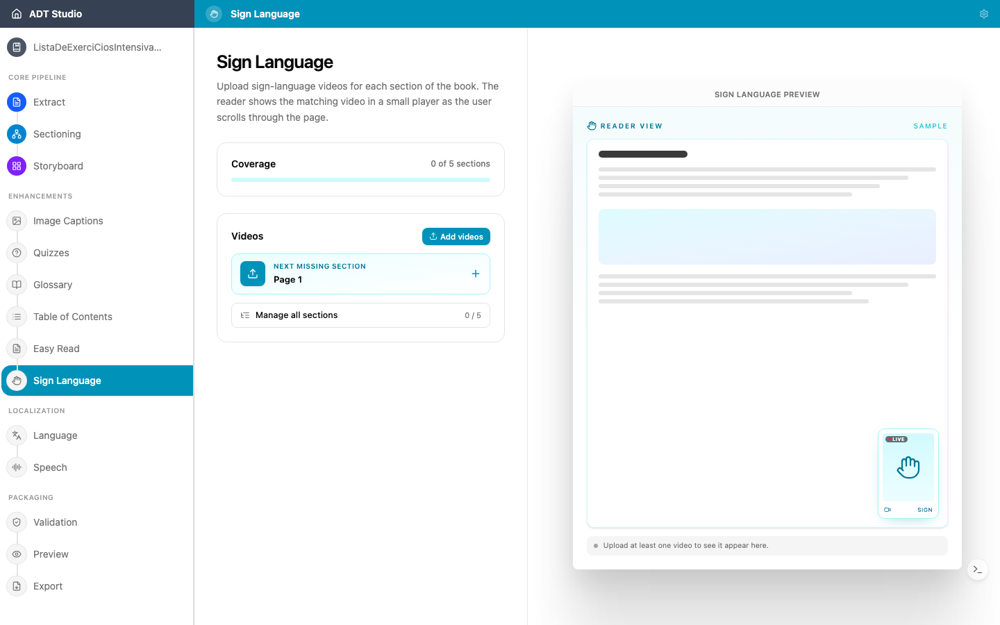

Para muchos estudiantes sordos, la lengua de señas es su primera lengua — y el texto escrito es una segunda. Los videos en lengua de señas integrados junto al contenido hacen que un ADT sea genuinamente accesible para estos estudiantes, en lugar de solo técnicamente legible.

Los ADT producidos con la iniciativa han incluido lengua de señas en lenguas de señas nacionales (por ejemplo, ASL y LIBRAS en ADT existentes).

## Decisiones a tomar

- **¿Qué lengua de señas?** Las lenguas de señas no son universales — cada país (a veces cada región) tiene la suya propia. La elección correcta depende de dónde se usará el ADT.
- **¿Cuál es la fuente de los videos?** El contenido en lengua de señas requiere intérpretes humanos y producción de video — no lo genera automáticamente la herramienta. Cada video se filma para **una sección del Storyboard** — las mismas secciones usadas en el resto del libro — así que un pase completo de lengua de señas significa producir un video por sección, no un único video para todo el libro. Esta etapa sirve para organizar videos que ya tienes, no para producirlos.

<Callout title="Haz esto una vez que el libro esté asentado">
Dado que cada video corresponde a una sección del Storyboard, la producción de lengua de señas normalmente debería empezar solo una vez que el contenido del libro y el flujo de secciones estén finalizados y aprobados — volver a grabar videos después de que una sección cambie o se reestructure resulta costoso. Trata Lengua de señas como una de las últimas etapas que ejecutes, no una temprana.
</Callout>

## Subir y asignar videos

Lengua de señas necesita que las secciones de tu libro estén construidas primero — si [Storyboard](/docs/convert-pdf/storyboard) todavía no ha terminado, la etapa te lo indica en lugar de dejarte ejecutarla. Cuando esté lista, abre la etapa **Lengua de señas**: aquí no hay ningún paso de IA que ejecutar, solo videos para subir y hacer coincidir con secciones, uno a la vez.

- **Agregar videos** para subir uno o más archivos `.mp4`/`.webm`. Los videos subidos empiezan **sin asignar** hasta que los relaciones con una sección.
- **Asignar** cada video a una sección del Storyboard desde un menú desplegable — un video por sección. Una barra de **Cobertura** muestra cuántas secciones del libro tienen un video, y un atajo de **Siguiente sección faltante** salta directamente al próximo vacío.
- **Gestionar todas las secciones** abre una lista completa de cada sección, para que puedas revisar o reasignar videos más allá del flujo de uno a la vez.

El lector muestra el video correspondiente en un reproductor pequeño mientras el usuario se desplaza por la página.

<Callout title="No forma parte del proceso de IA">
Lengua de señas no ejecuta ni regenera nada — es pura gestión de recursos. No hay nada que volver a ejecutar cuando cambia el contenido previo; si el texto de una sección cambia de manera significativa, revisa si su video sigue correspondiendo.
</Callout>
