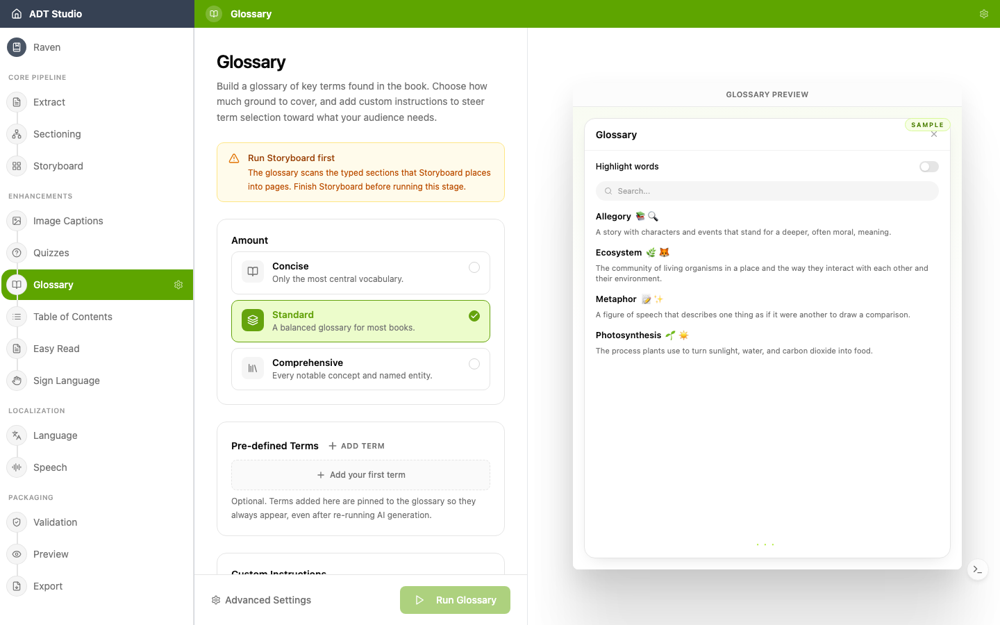

Un glossaire aide les apprenants à aborder un nouveau vocabulaire avec confiance. ADT Studio identifie les termes clés de votre contenu et génère un **glossaire pédagogiquement aligné** — des définitions rédigées pour soutenir l'apprentissage, pas de simples entrées de dictionnaire.

## Décisions à prendre

- **Quels termes méritent une entrée ?** Le vocabulaire spécialisé, technique ou lié au programme scolaire — oui. Les mots du quotidien — généralement pas. Révisez la sélection générée en pensant à votre public.
- **La définition est-elle au bon niveau ?** Une définition rédigée au-dessus du niveau de lecture du public manque son objectif. Vérifiez que le langage correspond aux apprenants.

## Configurer et générer

Comme les autres étapes d'Enrichissement, Glossaire nécessite que le [Storyboard](/docs/convert-pdf/storyboard) soit terminé au préalable. Une fois prêt, ouvrez l'étape **Glossaire** et définissez :

- **Quantité** — Concis, Standard, ou Complet — combien de vocabulaire couvrir.
- **Termes prédéfinis** (optionnel) — épinglez des mots spécifiques pour qu'ils apparaissent toujours, même après une régénération.
- **Instructions personnalisées** (optionnel) — orientez la sélection ou le ton.

Un aperçu d'exemple en direct sur la droite montre des termes et définitions d'exemple, avec un interrupteur pour surligner où les termes apparaîtraient dans le livre. Une fois prêt, sélectionnez **Exécuter le glossaire**.

## Réviser et modifier

Une fois le glossaire généré, basculez entre **Tous**, **Actifs** et **Élagués** (chacun avec un compteur), plus un interrupteur **Manuels uniquement** pour ne voir que les termes que vous avez ajoutés vous-même. Recherchez par terme ou définition, et triez par ordre alphabétique ou selon la fréquence d'occurrence d'un terme dans le livre. Chaque entrée indique si elle a été **ajoutée manuellement** ou **générée par l'IA**, ainsi que son nombre d'occurrences.

Utilisez **Ajouter un terme** pour définir votre propre vocabulaire. Pour agir sur les décisions ci-dessus, **élaguez** un terme dont vous ne voulez pas — il est masqué du résultat et ignoré lors des prochaines régénérations, sans supprimer vos autres modifications — ou **retirez** entièrement un terme ajouté manuellement.
