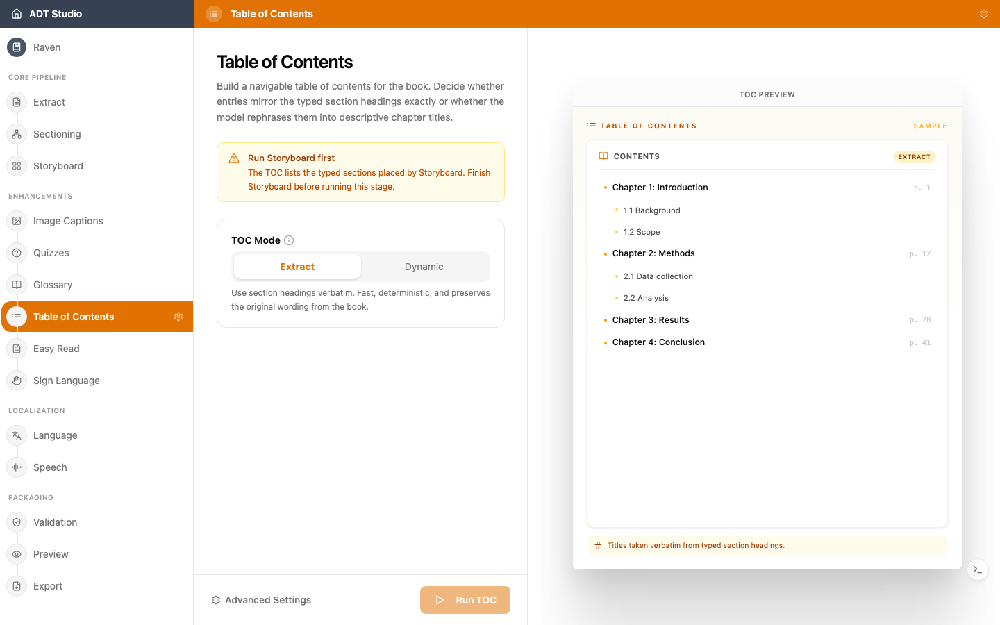

La table des matières est construite à partir des sections que le [Storyboard](/docs/convert-pdf/storyboard) place dans les pages — lesquelles proviennent elles-mêmes de la structure que vous avez confirmée pendant le [Découpage](/docs/convert-pdf/sectioning). Elle donne à chaque lecteur — et à chaque lecteur d'écran — une carte navigable du livre.

## Décisions à prendre

- **Reflète-t-elle le vrai livre ?** Si quelque chose semble faux ici — chapitres manquants, imbrication étrange, titres erronés — la cause se trouve presque toujours en amont, dans le découpage ou le storyboard, pas dans la table des matières elle-même. Corrigez la structure là-bas et la table des matières suit.
- **La profondeur est-elle correcte ?** Une table des matières avec chaque petit sous-titre peut être plus difficile à parcourir qu'une structure claire et peu profonde.
- **Mot pour mot ou reformulé ?** C'est exactement ce que décide le **Mode TDM** — voir ci-dessous.

## Configurer et générer

Table des matières nécessite que le Storyboard soit terminé au préalable. Une fois prêt, ouvrez l'étape **Table des matières** et choisissez un **Mode TDM** :

- **Extraction** — utilise les titres de section mot pour mot. Rapide, déterministe, et préserve la formulation d'origine.
- **Dynamique** — laisse le modèle rédiger des titres de chapitre descriptifs à partir du contenu de chaque section. Idéal pour les livres d'histoires, ou lorsque les titres sont absents.

Un aperçu d'exemple en direct sur la droite montre une liste de contenu imbriquée correspondant au mode choisi. Une fois prêt, sélectionnez **Exécuter la TDM**.

## Réviser et modifier

Une fois la table des matières générée, recherchez les entrées par titre, et utilisez **Ajouter une entrée** pour en insérer une manuellement. Le titre de chaque ligne est modifiable en place, et les flèches de retrait la déplacent d'un niveau d'imbrication vers le haut ou le bas (jusqu'à trois niveaux de profondeur) — utilisez **Retirer** pour en supprimer une entièrement.

Chaque entrée est liée à une section du livre — le sélecteur de lien permet de rechercher et de réassigner cette section, et l'icône de lien externe à côté ouvre la page liée dans un nouvel onglet afin que vous puissiez confirmer qu'elle pointe où elle devrait.
