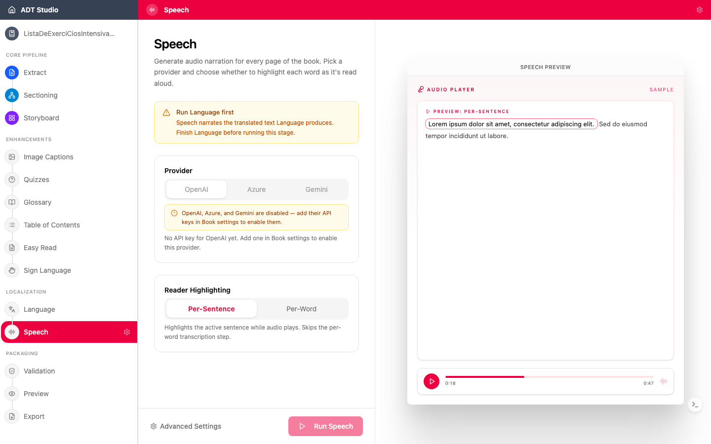

La narration transforme le texte en audio, afin que les apprenants puissent écouter le livre — essentiel pour les apprenants ayant des déficiences visuelles ou des difficultés de lecture, et précieux pour toute personne apprenant mieux en écoutant.

ADT Studio génère une **synthèse vocale localisée** : une narration naturelle dans la voix adaptée à chaque langue de votre ADT.

## Décisions à prendre

- **Quel contenu est narré ?** Un paramètre **Contenu à lire à voix haute** permet d'inclure ou d'exclure chaque catégorie indépendamment — texte de page, légendes d'images, réponses d'activités, entrées de glossaire et texte en lecture facile.
- **La voix correspond-elle au public et à la langue ?** Une voix qui semble naturelle dans une langue peut ne pas être disponible ou appropriée dans une autre. Écoutez des échantillons avant de générer le livre entier.
- **Vérifiez la prononciation des noms et des termes locaux.** La synthèse vocale peut trébucher sur les noms propres, les noms de lieux et le vocabulaire spécifique au programme scolaire. Vérifiez ponctuellement les sections qui en contiennent — ou remplacez uniquement l'audio de cette entrée (voir ci-dessous).
- **Les lecteurs ont-ils besoin d'un surlignage au niveau du mot ?** L'activer calcule automatiquement les horodatages des mots pendant la génération, afin que le lecteur puisse suivre mot par mot pendant la narration.

## Configurer et générer

Parole nécessite que votre contenu traduit soit prêt au préalable. Ouvrez l'étape **Parole** et définissez une voix par langue et par fournisseur, ainsi que :

- **Surlignage au niveau du mot** — lorsqu'il est activé, les horodatages des mots sont calculés automatiquement pendant la génération de la parole. Si vous le laissez désactivé, vous pouvez toujours calculer les horodatages manuellement plus tard depuis la vue Parole.
- **Contenu à lire à voix haute** — basculez quelles catégories de texte sont narrées ou non.

## Réviser, remplacer et modifier

Une fois la narration générée, parcourez les entrées par langue, filtrez pour ne voir que celles dont l'audio est encore **manquant**, et prévisualisez chaque version avec le sélecteur de version. Si la narration IA prononce mal un nom ou un terme, vous n'êtes pas limité à la régénération — chaque entrée dispose d'une action **Téléverser votre propre fichier audio** (ou **Remplacer ce fichier audio** si un existe déjà), afin de pouvoir substituer un clip enregistré manuellement pour ce seul élément de texte, sans toucher à rien d'autre.
