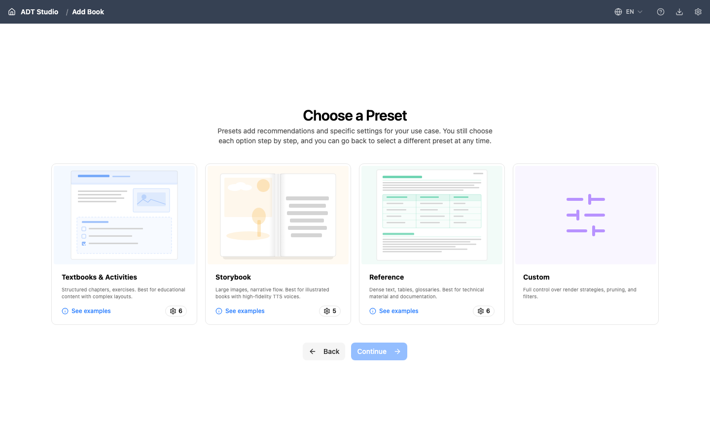
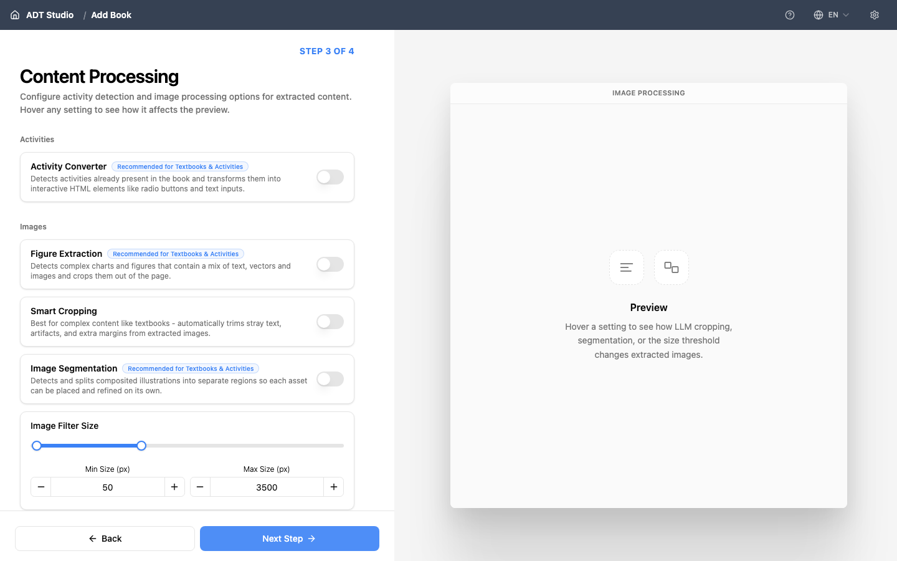

A extração é a etapa em que o ADT Studio lê seu PDF e o converte em conteúdo estruturado — texto, figuras e layout — sobre o qual todas as etapas seguintes se baseiam. É aqui que a IA faz sua primeira e mais importante passagem pelo seu livro.

Antes da extração ser executada, você configura como ela deve tratar seu documento. Essa configuração acontece em algumas subetapas, logo após você enviar seu PDF.

<Steps>

<Step>
### Escolha um Predefinido

Um predefinido é uma configuração inicial que corresponde ao tipo de documento que você está convertendo. Ele pré-seleciona configurações sensatas para que você não precise configurar tudo manualmente.

- **Livros didáticos e atividades** — capítulos estruturados e exercícios. Melhor para conteúdo educacional com layouts complexos.
- **Livro de histórias** — imagens grandes e fluxo narrativo. Melhor para livros ilustrados, combinado com narração de alta fidelidade.
- **Referência** — texto denso, tabelas e glossários. Melhor para material técnico e documentação.
- **Personalizado** — controle total sobre estratégias de renderização, poda e filtros, sem nada pré-selecionado para você.

Predefinidos são um ponto de partida, não um compromisso. Depois de escolher um, você ainda pode ajustar qualquer configuração individual nas etapas abaixo. Trocar de predefinido depois reinicia a configuração que você já alterou, então escolha a opção mais próxima primeiro.

Cada clipe abaixo executa uma página impressa real por todo o pipeline para seu predefinido correspondente — extração, layout e os recursos de acessibilidade que vêm com ele.

**Livros didáticos e atividades** — um capítulo impresso de ciências e uma página de atividade de caderno, ambos reconstruídos em conteúdo estruturado e acessível.

<video controls playsInline aria-label="A printed science textbook chapter on biomes is converted into an accessible e-learning page with easy-read mode, a glossary, and sign language." className="w-full rounded-lg border border-[color:var(--color-border)]">
  <source src="/videos/los-biomas.mp4" type="video/mp4" />
</video>

<video controls playsInline aria-label="A printed workbook activity page is converted into an AI-generated, interactive accessible activity." className="w-full rounded-lg border border-[color:var(--color-border)]">
  <source src="/videos/cuaderno5.mp4" type="video/mp4" />
</video>

**Referência** — uma página densa de livro didático com múltiplas colunas, reconstruída como um layout web responsivo e semântico.

<video controls playsInline aria-label="A complex, multi-column printed textbook page is converted into a responsive web layout." className="w-full rounded-lg border border-[color:var(--color-border)]">
  <source src="/videos/brazil.mp4" type="video/mp4" />
</video>

**Livro de histórias** — uma página de história ilustrada ganha narração texto-para-fala, descrições de imagem, traduções e um questionário.

<video controls playsInline aria-label="An illustrated storybook page gains text-to-speech narration, image descriptions, translations, and an interactive quiz." className="w-full rounded-lg border border-[color:var(--color-border)]">
  <source src="/videos/momo.mp4" type="video/mp4" />
</video>
</Step>

<Step>
### Informações básicas

Aqui você confirma o essencial:

- **Arquivo PDF** — o arquivo que você acabou de enviar.
- **Nome do projeto** — o identificador único que o ADT Studio usa como nome da pasta do seu livro. É sugerido a partir do nome do seu arquivo, mas você pode alterá-lo.
- **Quanto deste livro você quer processar?** — **Livro inteiro** para converter tudo, **Intervalo de páginas** para escolher um subconjunto (útil para testar em um capítulo de um PDF longo antes de se comprometer com o livro todo), ou **Dividir em partes** para distribuir partes por intervalo de páginas a pessoas diferentes e mesclar o trabalho concluído delas de volta em um único livro depois (veja [Dividindo um livro em partes](#splitting-a-book-into-parts) abaixo).

Não há um campo separado de "título do livro" ou "idioma de origem" aqui — o nome do projeto funciona como identificador, e o idioma é definido depois, na etapa Idiomas.
</Step>

<Step>
### Layout visual

Esta etapa informa ao ADT Studio como seu documento está organizado visualmente, para que a extração possa interpretar as páginas corretamente:

- **Estratégia de renderização** — como as páginas são reconstruídas (baseada em modelo, que é rápida e gratuita, ou com IA, que se adapta por página ao custo de processamento extra).
- **Modo de agrupamento de páginas** — **Dupla** ou **Individual**, se páginas frente a frente são tratadas como uma única unidade visual ou de forma independente.
- **Modo de seção** — **Modo de página** ou **Modo dinâmico**, como o conteúdo é dividido em seções.

O ADT Studio marca a opção que recomenda para o predefinido escolhido — na maioria dos casos, você pode aceitar a sugestão.
</Step>

<Step>
### Processamento de conteúdo

Aqui você escolhe qual processamento com IA roda sobre seu conteúdo durante a extração:

- **Conversor de atividades** — detecta e estrutura exercícios e atividades.
- **Extração de figuras** — extrai imagens e diagramas como figuras separadas.
- **Recorte inteligente** — recorta automaticamente as imagens extraídas para seu conteúdo relevante.
- **Segmentação de imagem** — divide imagens compostas em suas partes individuais, com uma configuração de **Dimensão mínima da imagem** para o menor tamanho aceitável de um segmento.
- **Filtro de tamanho de imagem** — um **Tamanho mínimo** e **Tamanho máximo** (em pixels) que filtram imagens pequenas ou grandes demais para serem relevantes (por exemplo, divisórias decorativas ou fundos de página inteira).

Você não precisa habilitar tudo agora. Recursos que você pular aqui geralmente podem ser executados depois — veja [Aprimore seu ADT](/docs/enhance).

</Step>

<Step>
### Idiomas

- **Idioma de edição** — o idioma em que você vai trabalhar ao revisar e editar o conteúdo. Deixe vazio para usar o idioma original do livro.
- **Idiomas de saída** — um ou mais idiomas para traduzir o ADT final. Deixe vazio para gerar a saída apenas no idioma do livro.

Adicionar idiomas de saída aqui não traduz nada imediatamente — isso define o que a etapa posterior [Idioma](/docs/localize/language) vai traduzir quando você chegar até ela. Cada idioma adicional adiciona processamento, e portanto custo, naquela etapa posterior.
</Step>

<Step>
### Crie seu ADT

Depois que suas configurações estiverem definidas, selecione **Criar ADT**. Este também é o momento em que o ADT Studio de fato cria a pasta do seu projeto (veja [Importar um PDF](/docs/convert-pdf/import-pdf)).

- Se você já tem uma chave de API salva, a extração começa automaticamente. Isso roda página por página e pode levar alguns minutos dependendo do tamanho do seu documento; você pode acompanhar o progresso na interface. O Seccionamento é uma etapa separada — você mesmo a executa depois, a partir da etapa **Seccionamento** do livro.
- Se você ainda não tem uma chave de API salva, seu projeto é criado com suas configurações em vigor, e você inicia a extração depois, a partir da etapa **Extrair** do livro (um botão **Executar** nessa etapa a inicia).

Se uma página falhar durante a extração, o ADT Studio pausa e pede para você decidir: **pular esta página e continuar**, ou **parar a etapa**. Há uma caixa de seleção para aplicar a mesma escolha a toda falha posterior naquela execução, então uma página com problema não te obriga a acompanhar o restante manualmente.

Quando a extração termina, seu livro existe como conteúdo estruturado dentro do ADT Studio — pronto para a próxima etapa: [Seccionamento](/docs/convert-pdf/sectioning).
</Step>

</Steps>

## Corrigindo os metadados do livro

Depois que a extração é executada, o título, autores, editora e idioma do livro aparecem no topo da etapa Extrair, junto com a contagem de páginas e um resumo escrito pela IA. Selecione **Editar metadados do livro** para corrigir qualquer coisa que a IA tenha errado.

Alterar o idioma é tratado de forma diferente dos outros campos: como narração, tradução, legendas, glossário e questionários são todos gerados por idioma, o ADT Studio avisa que as etapas posteriores já concluídas serão redefinidas e precisarão ser executadas novamente antes de você confirmar a mudança. Suas seções de página são mantidas de qualquer forma.

## Dividindo um livro em partes

Para um livro longo, **Dividir em partes** permite distribuir intervalos de páginas a pessoas diferentes (ou processá-los você mesmo separadamente) e remontar os resultados depois, em vez de uma única pessoa executar o livro inteiro do início ao fim. Um painel **Dividir e mesclar** na visão geral do livro cuida das duas direções:

- **Exportar uma parte** — escolha um intervalo de páginas e exporte-o como seu próprio `.zip` de projeto. Quem receber abre no próprio ADT Studio e passa pela extração, seccionamento e o restante, como um livro normal.
- **Mesclar uma parte concluída** — envie o `.zip` exportado de uma parte concluída de volta para o livro de origem. O ADT Studio mostra uma prévia do que vai mudar (páginas adicionadas ou substituídas, avisos) antes de você confirmar, e sinaliza se a parte foi processada com prompts ou modelos diferentes do restante do livro. Etapas de nível de livro (como o resumo do livro) são marcadas como desatualizadas e precisam ser executadas novamente assim que cada parte for mesclada, já que dependem do livro inteiro estar presente.

Os metadados do livro (título, autores, editora) viajam junto com a parte que contém a página 1 — até que essa parte seja mesclada, o livro permanece sem título.

<Callout title="Bom saber">
Se você alterar uma configuração e executar a extração novamente, o ADT Studio **só refaz o trabalho afetado pela sua mudança**. Todo o resto é reaproveitado instantaneamente dos resultados salvos, sem custo adicional. E nada se perde: os resultados anteriores são mantidos e você pode voltar a eles.
</Callout>
