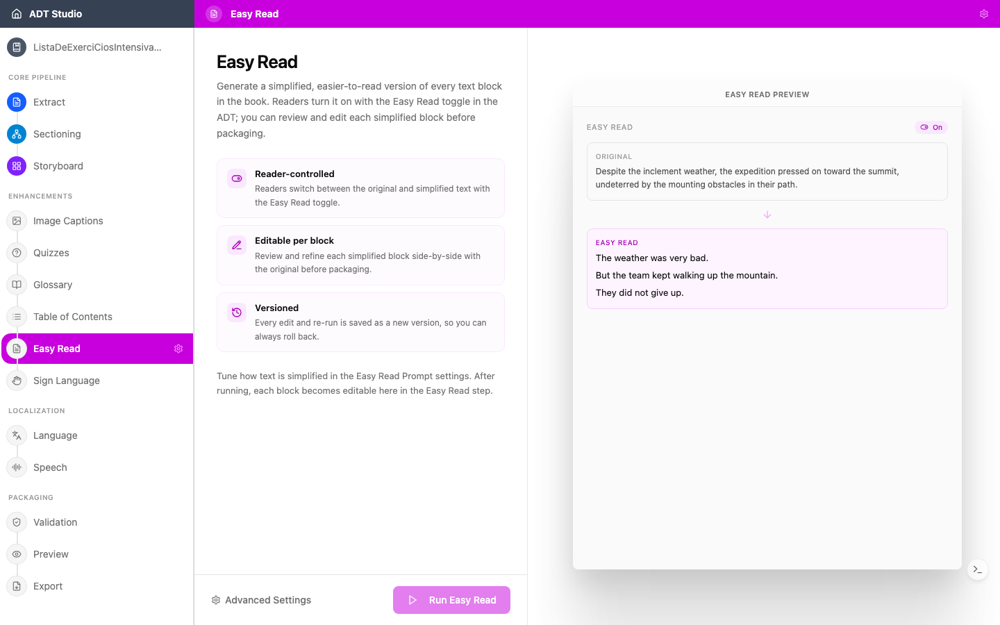

A Leitura Fácil é uma adaptação do conteúdo para uma linguagem e estrutura mais simples — frases mais curtas, palavras comuns, uma ideia de cada vez. Ela apoia alunos com deficiência intelectual, alunos ainda em processo de alfabetização e qualquer pessoa que se beneficie de um texto mais direto.

Uma versão em Leitura Fácil não é um resumo nem uma substituição. É o mesmo conteúdo, tornado mais acessível, oferecido junto ao original.

## Decisões a tomar

- **Seu público precisa disso?** Se o ADT for usado em salas de aula inclusivas, uma versão em Leitura Fácil amplia quem pode participar de forma significativa.
- **A revisão é essencial.** Simplificar conteúdo é um ato pedagógico. Verifique se a versão simplificada preserva o significado e não subestima o leitor.

## Configurar e gerar

A Leitura Fácil precisa que as páginas do seu livro já estejam diagramadas — se o [Storyboard](/docs/convert-pdf/storyboard) ainda não estiver concluído, a etapa avisa isso em vez de permitir que você a execute. Ajuste o **Prompt de Leitura Fácil** (e quantos blocos são processados por lote) nas configurações se quiser direcionar a simplificação, depois selecione **Executar Leitura Fácil**.

## Revisar e editar

Depois de gerado, cada bloco de texto simplificado fica lado a lado com o original, agrupado por página. Pesquise no texto original ou em Leitura Fácil, e navegue entre páginas se o livro tiver várias. Selecione o texto em Leitura Fácil de um bloco para editá-lo no local.

Os leitores alternam entre o texto original e o simplificado com um alternador de Leitura Fácil no próprio ADT — esta etapa não remove nem substitui o original, ela produz a versão alternativa ao lado dele. Cada edição e nova execução é salva como uma nova versão, então você sempre pode reverter.

<Callout title="Não é uma substituição">
O objetivo da Leitura Fácil não é fazer a versão "real" desaparecer — é dar aos leitores uma escolha. Um bloco de Leitura Fácil bem revisado se lê como um pensamento completo em si mesmo, não como uma nota sobre o original.
</Callout>
