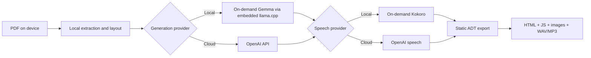

# ADT Studio engineering review and Momo AI benchmark

Date: 2026-08-03
Upstream reviewed: `unicef/adt-studio` `origin/develop` at `240fb737`
Implementation branch: `codex/local-gemma-audit`

## Executive verdict

**The team is moving in a sound product and architectural direction, but delivery governance and desktop security have not caught up with the product's power.** The monorepo boundaries, typed pipeline, local book storage, prompt/version logging, accessibility tooling, and active test suite are strong. The weakest areas are request-scoped credential handling, Electron hardening, merge controls, dependency automation, duplicate pipeline orchestration, and packaged desktop end-to-end coverage.

Release recommendation:

- **macOS local desktop pilot: GO with editorial review and monitoring.**
- **General signed macOS/Windows release: CONDITIONAL GO** after the P0/P1 controls below and real Windows validation.
- **Shared or internet-facing hosting: NO-GO** until authentication, tenant isolation, upload/archive limits, and credential isolation are complete.

The offline direction is justified. The app now embeds the inference runtime, not Ollama; Gemma and Kokoro weights download from pinned Hugging Face revisions only when selected. The exported ADT contains static HTML, JavaScript, images, and generated audio—not model weights or a runtime—so it remains portable and offline.

On the 20-page Momo test, OpenAI GPT-5.4 completed the pipeline in **91.7 seconds** for an estimated **$1.49**. The first Gemma 4 12B/Kokoro run took **895.3 seconds** at **$0 marginal API cost**. OpenAI was 9.8× faster and substantially better at image captions. A focused Gemma correction added full-page visual and extracted-text grounding; the result is reported below.

## Scope and method

This review covers architecture, code structure, desktop security, GitHub workflow, dependencies, documentation, local AI/TTS, PDF tooling, exported output, and a reproducible Momo comparison. Team-practice conclusions use current `origin/develop`; offline implementation conclusions use `codex/local-gemma-audit`. They are distinguished because the local feature branch contains work not yet present upstream.

Evidence sources:

- Current upstream repository and active GitHub rules/workflow/PR data on 2026-08-03.
- `pnpm@10.32.1 audit --prod` and recursive production dependency checks.
- Fresh, non-overwriting books generated from `/Users/amoghbanta/Downloads/UNICEF/momograde1.pdf` (SHA-256 `3d4e589013715ee89ee0e9ac1e7419daf4e4afd8bbdc9a85eaa4b34dd82c6468`).
- Page-by-page visual comparison against all 20 rendered PDF pages.
- SQLite LLM logs, pipeline state, generated artifacts, FFmpeg decode checks, Chromium all-page smoke tests, and Axe output.

Benchmark machine: Apple M2 Max, 32 GB unified memory. Local inference used Gemma 4 12B Q4, embedded llama.cpp `b10236`, Metal, 16K context, and 49 GPU layers. Local speech used Kokoro 82M q8 on CPU with `af_heart`. OpenAI used the repository's shipped default, `gpt-5.4`, and `gpt-4o-mini-tts`. GPT-5.6 was intentionally not substituted because this round measures the project's current default; it belongs in a separately labelled second round.

Limitations: this is one PDF, one machine, one run per condition, and a non-blind manual content review. It is a strong integration result, not a statistically significant model benchmark or WCAG certification.

## Architecture and product direction

This is the right product boundary:

1. PDF extraction, authoring state, and packaging remain deterministic application responsibilities.
2. LLM and speech providers are replaceable capabilities, not embedded throughout UI code.
3. Model downloads are optional and remain in Electron user data.
4. Generated audio is copied into the export, so the final ADT needs no model, account, API, Electron, or internet connection.
5. A cloud key can be added later to regenerate an individual stage without invalidating the local-first workflow.

The current implementation also answers the Ollama concern: **Ollama is not required.** The desktop app starts its own pinned llama.cpp server on loopback. Public, ungated Hugging Face downloads require no login; the current downloader intentionally rejects private/gated repositories rather than asking users for a Hugging Face token.

## What the current team is doing well

1. **Coherent monorepo boundaries.** `@adt/types`, storage, PDF, LLM, pipeline, agents, API, Studio, runtime, and desktop are separated and built through TypeScript project references.
2. **Strong domain contracts.** Strict TypeScript and Zod schemas provide useful boundaries around non-deterministic model output.
3. **Observable AI pipeline.** Prompt resolution, per-call logs, timing, tokens, retries, validation feedback, cache state, and task progress are first-class rather than hidden.
4. **Local, portable book state.** A book-scoped SQLite database plus files is understandable, inspectable, and compatible with offline desktop use.
5. **Accessibility is in the development loop.** Axe assessment and browser recheck infrastructure exist and generated content is captioned and narrated.
6. **Healthy documentation culture.** Architecture, decisions, developer guidance, release guidance, and feature specifications are materially better than typical early-stage repositories.
7. **Active iteration.** Recent PR descriptions are generally detailed and current upstream commits show careful work around unsaved changes, invalidation, and pipeline mutation safety.
8. **Meaningful CI breadth.** Core types/tests, Docker, i18n, and release workflows exist; the gap is packaged end-to-end enforcement, not an absence of automation.

## What the offline branch adds well

1. Model recommendations, resumable verified downloads, immutable revisions, and an embedded llama.cpp runtime instead of an Ollama dependency.
2. Runtime health, backend/device, context, GPU layers, memory estimate, latency, and token-rate diagnostics in the UI.
3. On-demand Kokoro with generated WAVs included in the ADT while model weights stay outside the installer/export.
4. Cross-platform llama.cpp artifact preparation and smoke checks for macOS, Windows, and Ubuntu.
5. Provider abstractions that retain OpenAI as an optional regenerate/improve path.

Current conservative recommendation thresholds are E2B at 8 GB, E4B at 12 GB, 12B at 20 GB, and 26B at 48 GB; this 32 GB Mac therefore recommends 12B. These are selection guardrails, not performance guarantees, and the UI allows an informed override.

## Priority findings

### P0 — fix before multi-user use

1. **Cloud credentials are process-global during requests.** Upstream [`page-edit-service.ts`](https://github.com/unicef/adt-studio/blob/240fb7376799b0b5a91c0e5949fc8d53477846a8/apps/api/src/services/page-edit-service.ts#L54), [`book-summary.ts`](https://github.com/unicef/adt-studio/blob/240fb7376799b0b5a91c0e5949fc8d53477846a8/apps/api/src/routes/book-summary.ts#L50), [`easy-read.ts`](https://github.com/unicef/adt-studio/blob/240fb7376799b0b5a91c0e5949fc8d53477846a8/apps/api/src/routes/easy-read.ts#L222), [`fonts.ts`](https://github.com/unicef/adt-studio/blob/240fb7376799b0b5a91c0e5949fc8d53477846a8/apps/api/src/routes/fonts.ts#L425), and [`pages.ts`](https://github.com/unicef/adt-studio/blob/240fb7376799b0b5a91c0e5949fc8d53477846a8/apps/api/src/routes/pages.ts#L2811) temporarily assign `process.env.OPENAI_API_KEY`, then restore it. Concurrent requests can overlap and use another request's key. This is both a correctness and credential-isolation defect.

   **Action:** pass immutable credentials into provider factories per request. Delete every request-time environment mutation. Add a concurrency test with two different keys and delayed provider calls. The request-scoped translation evaluation path is a useful precedent.

2. **Hosted mode lacks an application authentication boundary.** The desktop loopback server is safer, but the same API exposes book mutation, generation, export, and deletion routes when hosted.

   **Action:** require authentication and authorization before shared hosting; add tenant-scoped storage, CSRF protection, trusted-proxy rules, rate limits, and explicit upload/archive limits.

### P1 — fix before broad desktop release

3. **Electron hardening is incomplete.** Upstream [`main.ts`](https://github.com/unicef/adt-studio/blob/240fb7376799b0b5a91c0e5949fc8d53477846a8/apps/desktop/src/main/windows/main.ts#L38-L52) sets `sandbox: false` and enables DevTools unconditionally. No restrictive CSP, global navigation guard, permission request handler, or consistent IPC sender validation was found. This matters because the app processes and previews user-supplied/generated content. The offline branch already limits production DevTools and external window protocols, but sandbox/CSP/navigation/IPC work remains.

   **Action:** narrow the preload until sandboxing can be enabled; add CSP, `will-navigate` allowlisting, permission denial by default, IPC sender checks, and Electron fuse review. These are explicit [Electron security recommendations](https://www.electronjs.org/docs/latest/tutorial/security).

4. **Merge controls do not enforce review or CI.** The active ruleset is named “Prevent pushing to main,” but its `~DEFAULT_BRANCH` target currently means `develop`. It requires a PR but requires zero approvals, no code-owner review, no last-push approval, no resolved conversations, and no status checks. `main` is not covered by an equivalent active rule. There is no `CODEOWNERS`, `CONTRIBUTING.md`, `SECURITY.md`, PR template, or dependency-update bot configuration.

   GitHub snapshot, latest 50 merged PRs:

   - 43/50 had zero recorded reviews.
   - 22/50 changed more than 1,000 lines.
   - 14/50 changed more than 30 files.
   - PR #550 changed 36,841 lines across 403 files with zero reviews.
   - Latest 30 workflow runs: 18 successful, 10 failed, 2 skipped. Several are repeated iterations on active PRs, but checks are not merge-gated.

   **Action:** require one approval, CODEOWNERS for security/desktop/pipeline areas, successful CI, resolved threads, and approval after the last material push. Protect both release and development branches. Prefer small PRs; require an explicit decomposition or migration plan above an agreed size threshold.

5. **The offline branch's local model supply chain needs a trust policy.** Gemma downloads are pinned by repository revision, expected size, SHA-256, and license metadata—good. Kokoro installation also verifies immutable revisions, hashes, sizes, file shape, and model type. However, the UI can search arbitrary Hugging Face repositories and execute compatible ONNX weights without presenting license/trust status.

   **Action:** show repository owner, revision, license, size, adapter, languages, and trust tier before install. Default to an allowlisted catalog; place community models behind an advanced warning. Record this metadata in the book manifest for reproducibility.

6. **Two orchestration implementations can drift.** The desktop/API path is in [`stage-runner.ts`](../apps/api/src/services/stage-runner.ts) (3,655 lines); the shared/CLI DAG is in [`pipeline-dag.ts`](../packages/pipeline/src/pipeline-dag.ts) (1,067 lines). A successful CLI run does not prove the app path, and provider behavior must be maintained twice.

   **Action:** move stage executors and dependency/invalidation rules into one pipeline package. Keep API/CLI as thin progress, cancellation, and decision adapters.

7. **Packaged desktop end-to-end coverage is missing.** CI tests the runtime artifact on three operating systems, but TypeScript/tests run only on Ubuntu and CI does not package, launch, import a PDF, generate a minimal book, and open the export on each OS.

   **Action:** add a small deterministic fixture and packaged smoke path for macOS, Windows, and Linux. Keep signing/notarization in release workflows, but make unsigned package/launch/import/export a required check.

8. **The desktop API has no per-launch capability token.** Random loopback port binding is good, but another local process can discover and call the API.

   **Action:** create a high-entropy per-launch bearer token, inject it only through the preload boundary, validate the renderer origin, cap request bodies, and rotate it on restart.

### P2 — planned engineering improvement

9. **Several modules are too large to change safely.** `stage-runner.ts` is 3,655 lines, `pages.ts` 2,903, and `tts.ts` 1,459. These files mix HTTP, orchestration, storage, provider selection, validation, and presentation-specific behavior.

   **Action:** split by command/use case behind characterization tests. Do not rewrite; extract request parsing, application services, provider adapters, and persistence incrementally.

10. **Upstream dependency hygiene is reactive.** A pinned `origin/develop` production audit reports **1 critical, 6 high, 24 moderate, and 9 low** advisories across 526 production dependencies. Critical/high paths include Seroval, js-yaml, LiquidJS, PostCSS, and `ws`. Recursive outdated analysis reports 74 production packages. The offline branch's targeted upgrades/overrides materially improve this to **0 critical, 0 high, 19 moderate, and 7 low** across 533 dependencies, with 56 packages still outdated. Remaining reported paths include Hono/node-server, DOMPurify through Monaco, `jsondiffpatch`, YAML, and the AI SDK. Reachability must be assessed; audit counts alone are not exploitability proof. `@adt/pipeline` also declares Electron 39 as a production dependency while the desktop app resolves Electron 41, creating two large security/runtime lifecycles.

    **Action:** merge or independently reproduce the offline branch's Seroval/js-yaml/LiquidJS/PostCSS/`ws` fixes first, then evaluate Hono/node-server and DOMPurify reachability. Add Renovate or Dependabot with grouped weekly patch PRs. Move Electron-only assessment behind an optional/desktop adapter or aligned peer dependency. Treat AI SDK/Electron/PDF.js major upgrades as measured migrations, not blind updates. Move pnpm settings to the workspace format before adopting pnpm 11; the current pnpm 11 check warns that the root `pnpm` field would be ignored.

11. **Documentation overstates or drifts from behavior.** The README download badges still target `v0.3.0-electron`; it documents a missing `test:coverage` script and says “WCAG-validated output.” The generated assessment currently disables color contrast, so this is not a WCAG conformance claim. `ARCHITECTURE.md` still describes processing as OpenAI-driven despite the embedded local path.

    **Action:** automate release badge links, validate documented commands in CI, describe automated accessibility checks precisely, and update the architecture/provider diagrams.

12. **HF speech search is broader than actual compatibility.** The UI searches Hugging Face text-to-speech repositories, but the installer accepts only the current Kokoro/StyleTTS2 ONNX file contract and the runtime advertises English variants only. This is replaceable architecture, but not yet generic multilingual TTS.

    **Action:** label search results as compatible/incompatible and introduce an explicit adapter registry with language, voice, phonemizer, format, hardware, license, and model-file requirements.

13. **TOC generation lacks a content-quality gate.** Both benchmark providers produced technically valid but editorially weak TOCs for a short continuous story. Schema validity is not usefulness.

    **Action:** add deterministic exclusions for cover/vision/copyright pages, duplicate-title suppression, minimum section span, and a “continuous story” fallback that omits a synthetic TOC or uses one story entry.

14. **Recursive LLM schemas are weakened at generation time.** Runtime warnings show recursive references being reduced to `any`; later Zod validation catches some errors but the provider receives a looser schema.

    **Action:** create bounded, LLM-safe transport schemas and convert them to richer recursive domain structures after validation. Treat every schema downgrade as telemetry, not a silent warning.

15. **Long local speech batches reduce API responsiveness.** During the 129-file Kokoro stage, status requests slowed from milliseconds to seconds and one monitoring GET transiently failed even though generation continued successfully.

    **Action:** isolate local speech in a bounded worker/utility process, keep progress and cancellation on the API thread, and add a responsiveness SLO to the packaged smoke test.

## Reproducible Momo benchmark

### Configuration

| Run | LLM | Speech | Concurrency | Full pipeline |
|---|---|---|---:|---|
| Gemma before | `local:gemma4-12b` | Kokoro q8/WAV | 1 | extract → package |
| OpenAI baseline | `openai:gpt-5.4` | `gpt-4o-mini-tts`/MP3 | 32 | extract → package |
| Gemma improved | `local:gemma4-12b` | Kokoro q8/WAV | 1 | extract → package |

Every run created a fresh book and stopped on page errors. Run records are in [`docs/benchmarks/momo`](benchmarks/momo/), and the harnesses are [`benchmark-momo-ai.mjs`](../scripts/benchmark-momo-ai.mjs), [`analyze-momo-benchmarks.mjs`](../scripts/analyze-momo-benchmarks.mjs), and [`smoke-adt-exports.mjs`](../scripts/smoke-adt-exports.mjs).

### Measured result

| Metric | Gemma before | Gemma improved | OpenAI GPT-5.4 |
|---|---:|---:|---:|
| Full wall time | 895.3 s | 953.7 s | 91.7 s |
| Relative to OpenAI | 9.76× slower | 10.40× slower | 1.00× |
| Logged input/output tokens | 243,837 / 14,338 | 250,041 / 14,341 | 465,926 / 13,090 |
| Logged call errors | 0 | 0 | 0 |
| Quizzes | 5 | 5 | 5 |
| Glossary terms | 13 | 13 | 27 |
| TOC entries | 4 | 4 | 2 |
| Narrated text/audio files | 129 | 129 | 146 |
| Generated audio duration | 387.3 s | 380.7 s | 496.5 s |
| Unpacked export size | 35.6 MB | 43.1 MB | 25.6 MB |
| Audio decode errors | 0 | 0 | 0 |
| Chromium pages/errors | 22 / 0 | 22 / 0 | 21 / 0 |
| Estimated API cost | $0 | $0 | $1.49 |

Token counts are provider-specific and not a cross-model efficiency metric: image accounting and tokenizers differ. The local cost excludes electricity and the one-time model download.

The first local run's main sequential costs were page sectioning (360.6 s), Kokoro speech (179.7 s), image cropping (106.7 s), captions (85.1 s), and glossary (56.2 s). Page sectioning sends roughly 10K local tokens per page, making prompt/schema simplification the highest-value latency project. Preserve llama.cpp prefix caching, deterministically skip blank/non-content work where safe, and move TTS to a worker before experimenting with local concurrency above one. OpenAI's 32-way concurrency is the main reason summed provider time (559.5 s) still produced a 91.7-second wall time; it is not an apples-to-apples hardware throughput result.

### Content quality

Manual scoring treated a story caption as correct only when its key character(s), action, and setting matched the source page. Minor wording differences were allowed.

| Area | Gemma before | Gemma improved | OpenAI GPT-5.4 |
|---|---|---|---|
| Metadata | Correct | Correct | Correct |
| Core story text | Retained; 4 footer artifacts entered catalog | Retained; same 4 footer artifacts | Retained; no `Reprint 2023` artifacts |
| Story image captions | **8/15 correct** | **10/15 correct** | **15/15 correct** |
| Quiz grounding | 5/5 coherent and grounded | 5/5 coherent and grounded | 5/5 coherent and grounded |
| Glossary | 13 concise terms | 13 concise terms | 27 terms, but duplicated inflections such as `jump/jumped`, `stick/sticks`, and `wake up/woke` |
| TOC usefulness | Fail: duplicate title and final sentence | Fail: duplicate title, final sentence, and `VISION` | Fail: cover title plus institutional `VISION` only |
| Audio technical validity | Pass: 129 PCM16 mono 24 kHz WAVs | Pass: 129 PCM16 mono 24 kHz WAVs | Pass: 146 mono 24 kHz MP3s |
| Export execution | Pass | Pass: 22/22 pages, zero browser errors | Pass: 21/21 pages, zero browser errors |

The earlier local baseline document described selected captions too positively. Full page-by-page review found material errors: a monkey became a person/child, a leopard became a giraffe, ground became snow, and the falling action on pages 16–17 became sleeping/resting.

### Gemma improvement and result

Root cause: the Gemma-specific caption prompt supplied only the extracted crop and a book summary. The cloud prompt also supplied the full page. Small or imperfect crops removed the nearby story text and scene context needed to distinguish Momo, leopards, and the current action.

Change: [`prompts/gemma4/image_captioning.liquid`](../prompts/gemma4/image_captioning.liquid) now supplies the full-page image and bounded, explicitly untrusted extracted page text. The pipeline passes that text through both orchestrators, uses the crop for visible details, and forbids unsupported guesses. The recorded SQLite request log confirms `<page_text>` and both images were present in the live benchmark request.

The correction raised story-caption accuracy from **8/15 to 10/15**. It fixed the child/giraffe errors on pages 8 and 10 and the sleeping-versus-falling error on page 16. It did not match the cloud baseline: page 1 still became a boy, pages 11 and 18 invented snow, page 14 missed the hanging/shaking action, and page 17 changed falling into lying down. The exact page rubric and decisions are recorded in [`caption-review.csv`](benchmarks/momo/caption-review.csv).

Conclusion: local Gemma/Kokoro is viable for private, zero-API-cost first drafts, but it is not a drop-in quality replacement for GPT-5.4 on this PDF. Keep mandatory preview/editorial approval, expose cloud regeneration by stage, and treat the local result as a draft until corpus-level gates prove otherwise.

### Cost, privacy, and resource trade-off

OpenAI cost was calculated from the actual logged GPT-5.4 usage using [official pricing](https://openai.com/index/introducing-gpt-5-4/): 465,926 input tokens at $2.50/M plus 13,090 output tokens at $15/M = **$1.361**. Speech is estimated at **$0.124** from 8.27 generated minutes at approximately $0.015/min; the model page currently lists $0.60/M input text tokens and $12/M output audio tokens for [`gpt-4o-mini-tts`](https://developers.openai.com/api/docs/models/gpt-4o-mini-tts). Total estimated run cost: **$1.485**. Actual account billing can differ because the speech response did not expose per-request audio token usage.

Local marginal API cost is $0 after download. Gemma 12B requires a 7.38 GB download; current diagnostics estimated 7.20 GB model GPU memory, Metal backend, and 49 loaded GPU layers on this machine. During the grounded run, the model process peaked at 14,189,936 KiB RSS (13.5 GiB); a separate full local run measured 11,890,176 KiB (11.3 GiB) combined API/model peak, showing that unified-memory/RSS observations vary and should be treated as capacity guidance rather than an exact requirement. Kokoro q8 adds about 89 MB plus selected voice data. Models are shared across books, not duplicated in the installer or export.

Privacy difference: local generation keeps PDF pages, text, and narration on the device after the initial model download. Cloud generation transmits page content/images and narration text to OpenAI. OpenAI states API data is not used for training by default; relevant endpoints have standard abuse-monitoring retention and are eligible for approved Zero Data Retention controls. See [OpenAI API data controls](https://platform.openai.com/docs/models/default-usage-policies-by-endpoint).

## Local speech recommendation

The current Kokoro integration is correct for the export architecture: synthesis happens inside the desktop generation workflow and resulting WAVs are bundled into the static ADT. Kokoro does not run in the exported HTML.

Near-term recommendation:

1. Keep Kokoro q8 as the small English default.
2. Make `SpeechProvider` capability-driven: adapter, language/locale, voices, phonemizer, expected files, device, memory, license, output formats, and streaming support.
3. Use an allowlisted catalog for normal users and HF repository paste/search for advanced users.
4. Benchmark every language with native reviewers before marking it supported; technical synthesis alone is insufficient for children and education.
5. Store model/revision/voice/license in the book provenance and export metadata, while exporting only generated audio.

Candidates to test behind adapters:

- [`sherpa-onnx`](https://github.com/k2-fsa/sherpa-onnx): strongest near-term runtime candidate because it supports offline TTS, JavaScript, macOS/Windows/Linux arm64/x64, and multiple engines including Kokoro, Piper/VITS, and Kitten. It still adds native artifacts that must be signed and tested per OS.
- [`Chatterbox`](https://github.com/resemble-ai/chatterbox): 23 languages and MPS/CPU support, but a heavier Python/PyTorch operational footprint. Treat it as an optional quality tier, not the default desktop dependency.
- [`Qwen3-TTS`](https://github.com/QwenLM/Qwen3-TTS): Apache-2.0, 0.6B/1.7B family with ten languages and expressive controls. The official path is Python and recommends FlashAttention-capable hardware, so it needs a separate Apple Silicon/Windows runtime and quality benchmark before integration.

Do not enable voice cloning by default. It introduces consent, impersonation, safeguarding, and provenance requirements unrelated to ordinary textbook narration.

## PDF tooling decision

[`firecrawl/pdf-inspector`](https://github.com/firecrawl/pdf-inspector) was tested on Momo from a temporary install (`1.11.2`). It classified all 20 pages as `Mixed` in about 8 ms and returned 2,769 Markdown characters. It is useful, but it did not improve the Momo ADT output by itself because ADT Studio also needs page images, figures/crops, coordinates, fonts, and deterministic cross-platform packaging.

Recommendation: integrate it only behind a `PdfClassifier`/router interface to cheaply decide direct extraction versus OCR/advanced layout. Keep MuPDF/WASM as the default extractor until coordinate, image, and package parity is proved.

For hard documents, benchmark on demand rather than bundling large runtimes:

- [`Docling`](https://github.com/docling-project/docling) for local OCR, reading order, tables, and a unified document representation across macOS/Windows/Linux.
- [`MinerU`](https://github.com/opendatalab/MinerU) for complex layouts, formulas, tables, header/footer removal, and 109-language OCR, accepting its much larger Python/model footprint and license review.

Acceptance gate for any replacement: fixed multilingual corpus, coordinate fidelity, extracted figures, reading order, OCR accuracy, peak memory, cold/warm time, model size, license, signed macOS/Windows packaging, and a full ADT quality comparison. A faster Markdown string is not enough.

## 30/60/90-day plan

| Window | Work | Acceptance evidence |
|---|---|---|
| 0–30 days | Remove process-global keys; enforce one review + CI; add CODEOWNERS/SECURITY/PR template; patch reachable Hono/DOMPurify paths; correct README/architecture claims | Concurrency credential test; active ruleset export; clean pinned production audit or tracked exceptions; docs-command CI |
| 0–30 days | Add Momo plus 4–6 representative multilingual/scan/table PDFs to a versioned evaluation corpus | Re-runnable quality, wall-time, retry, memory, export, and cost report per provider |
| 31–60 days | Enable Electron sandbox/CSP/navigation/IPC hardening; add per-launch API token | Security test checklist and packaged attack-regression tests |
| 31–60 days | Consolidate orchestration and add packaged import→export smoke on macOS/Windows/Linux | One stage graph; required OS checks; identical invalidation behavior |
| 31–60 days | Add capability-driven speech adapter registry and model trust/license UI | Compatible results only; provenance saved; unsupported language blocked clearly |
| 61–90 days | Pilot sherpa-onnx multilingual voices; benchmark Chatterbox/Qwen3-TTS as optional quality tiers | Native-speaker review, real-time factor, memory, size, and signed packaging gates per language |
| 61–90 days | Add PDF classifier routing and compare Docling/MinerU on the hard corpus | Routing improves quality or time without regressing normal PDFs |
| 61–90 days | Validate signed/notarized macOS and real Windows x64 builds | Clean-machine install, model download/resume, Momo generation, export playback, update/uninstall tests |

## Final recommendation to the team

Keep the current modular, local-first direction. Do not replace it with an Ollama dependency, a generic Hugging Face execution path, or a heavy PDF/TTS runtime bundled for every user. Strengthen the boundaries already present: request-scoped providers, capability registries, verified on-demand artifacts, one orchestrator, hard desktop security, and enforced human review.

The engineering foundation is promising. The next maturity step is not more features; it is making security, review, dependency lifecycle, reproducible evaluation, and packaged cross-platform testing as systematic as the pipeline itself.
